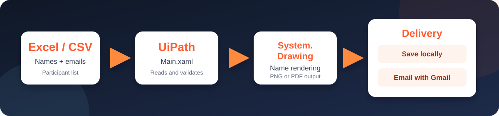
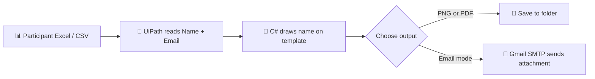

<div align="center">


<p>
  <a href="https://www.uipath.com/"></a>
  
  
  
</p>

<p><b>Bulk-create personalised certificates from an Excel or CSV file, then save or email them automatically.</b></p>

</div>

---

## What it does

This attended UiPath automation takes a participant list, prints each participant's name onto a certificate template, and creates a separate certificate for every person.

<div align="center">
  
</div>

## Key features

| | Feature | Description |
| :---: | --- | --- |
| 📄 | **Bulk processing** | Reads participant names and email addresses from Excel (`.xlsx`, `.xls`) or CSV. |
| 🎨 | **Custom design** | Choose name position, font family, size, and colour. |
| 🖼️ | **Flexible output** | Creates PNG or PDF certificates from PNG, JPG, or JPEG templates. |
| 📬 | **Two delivery modes** | Save to a local folder or email certificates through Gmail. |
| 🔁 | **Duplicate protection** | Skips certificates that have already been generated. |
| 🧾 | **Useful logs** | Tracks progress, skipped rows, duplicates, and errors. |

## Tech stack

<p>
  
  
  
  
  
  
</p>

| Technology | Used for |
| --- | --- |
| **UiPath Studio** | Building and executing the `Main.xaml` workflow |
| **C# Invoke Code** | Reading files, rendering names, creating output, and sending emails |
| **System.Drawing** | Drawing participant names on the certificate image |
| **Excel / CSV** | Participant name and email data source |
| **Gmail SMTP** | Sending completed certificates as attachments |

## Before you start

| Requirement | Details |
| --- | --- |
| UiPath Studio | Version 2026.0 or later |
| Operating system | Windows (the project uses `System.Drawing`) |
| Certificate template | PNG, JPG, or JPEG image |
| Participant data | Excel or CSV with `Name` and `Email` columns |
| Email delivery | Gmail account plus an App Password |

## Participant file format

Create an Excel or CSV file with exactly these headers:

| Name | Email |
| --- | --- |
| Alex Johnson | alex@example.com |
| Priya Sharma | priya@example.com |

> [!TIP]
> Start with one test participant. It makes it easy to fine-tune the name position and font size before creating every certificate.

## Setup and run

### 1. Get the project

```bash
git clone https://github.com/shahid-afrid/Certificate-name-automation---UiPath.git
```

Or select **Code → Download ZIP** on GitHub, then extract the ZIP.

### 2. Open in UiPath Studio

1. Open **UiPath Studio**.
2. Select **Open a Local Project**.
3. Browse to the cloned or extracted project folder.
4. Select `project.json`.
5. Restore dependencies if UiPath Studio asks you to do so.

### 3. Run the automation

1. Open `Main.xaml`.
2. Click **Run**.
3. Select your participant Excel/CSV file.
4. Select your certificate template image.

### 4. Configure the certificate

Enter the values requested by the workflow:

| Prompt | What to enter | Example |
| --- | --- | --- |
| X position | Horizontal name placement | `450` |
| Y position | Vertical name placement | `320` |
| Font size | Size of the participant name | `48` |
| Font family | Installed Windows font | `Arial` |
| Font colour | Black, White, Red, Blue, Gold, or another colour | `Gold` |
| Output format | Certificate file format | `PNG` or `PDF` |

### 5. Select delivery mode

| Mode | Result |
| --- | --- |
| **Local** | Choose an output folder and certificates are saved there. |
| **Email** | Certificates are sent to the email address in each participant row. |

## Gmail App Password setup

> [!IMPORTANT]
> Gmail requires an **App Password** for SMTP. Never enter your normal Gmail password in the automation.

### Create an App Password

1. Enable **2-Step Verification** on the Gmail account that will send certificates.
2. Open [Google App Passwords](https://myaccount.google.com/apppasswords).
3. Sign in to the sender Gmail account if requested.
4. Type an app name, for example: `UiPath Certificate Automation`.
5. Click **Create**.
6. Copy the 16-character App Password shown by Google.
7. Store it safely: Google displays it only once.

### Use it in this project

1. Choose **Email** for delivery mode.
2. Choose an email template or enter a custom subject and message.
3. Enter the sender Gmail address when UiPath prompts you.
4. Paste the 16-character App Password when requested.
5. The workflow attaches and sends every generated certificate to its matching participant email address.

## Workflow at a glance



## Project structure

```text
Certificate-name-automation---UiPath/
├── assets/
│   └── certificate-flow.svg # Visual workflow graphic
├── Main.xaml               # Main UiPath workflow
├── project.json            # Project settings and dependencies
└── README.md               # Documentation
```

## Security and privacy

- 🔐 Never commit Gmail App Passwords.
- 👤 Do not upload participant spreadsheets, certificates, or templates containing private data.
- 🛡️ The App Password is requested only during runtime and is not stored in this project.
- 🚫 `.gitignore` excludes local data, templates, generated files, and UiPath cache files.

---

<div align="center">
  Built with <b>UiPath</b> and <b>C#</b> for faster certificate personalisation.
</div>
